# Neo-Unify: Understanding Unified Multimodal Models

Toy-scale experiments inspired by [Neo-Unify](https://huggingface.co/blog/sensenova/neo-unify) (SenseNova), which introduces an encoder-free unified multimodal model with a Mixture-of-Transformers (MoT) backbone. This repo is **not** affiliated with the original work -- it's a from-scratch exploration of the ideas they describe, built on synthetic 16x16 images to see how the architecture behaves at mini scale.

Built with [MLX](https://github.com/ml-explore/mlx) on Apple Silicon. Trains on synthetic 16x16 RGB images (6 classes: spiral, triangle, circle, cross, checkerboard, gradient).

## 1. The Landscape

```
Unified Multimodal Models
|
+-- Encoder-based (use VQ-VAE / VQGAN tokenizer)
|   +-- Chameleon, Emu3, LlamaGen
|   +-- Phase A: VQ-VAE + AR Transformer
|
+-- Encoder-free (raw pixels, no tokenizer)
    +-- Generation only
    |   +-- Transfusion, JanusFlow
    |   +-- Phase B: Flow Matching Transformer
    |
    +-- Unified (understand + generate)
        +-- Neo-Unify: MoT backbone, dual pathways
        +-- Phase C: Mini Neo-Unify <-- THIS PROJECT
```

## 2. What's Implemented

| Phase | Approach | Maps To | Key Idea |
|-------|----------|---------|----------|
| **A** | VQ-VAE + AR Transformer | Chameleon/Emu3 | Encode images to discrete tokens, predict next token autoregressively |
| **B** | Flow Matching Transformer | Transfusion/JanusFlow | Encoder-free, predict velocity field for continuous ODE generation |
| **C** | Mini Neo-Unify (MoT) | **Neo-Unify** | ONE model with shared attention + task-specific expert FFNs for both understanding AND generation |
| **Exp CFG** | Neo-Unify + CFG/EMA/RK2 | -- | Classifier-free guidance, EMA weights, RK2 solver, reconstruction head |
| **Exp Latent** | Neo-Unify in Latent Space | -- | Generation in VQ-VAE latent space (4x4x64) with frozen decoder |

## 3. Project Overview

**Goal:** Explore whether a single transformer backbone can unify image *understanding* (classification) and image *generation* (flow matching) without degrading either task -- the "Neo-Unify" hypothesis.

**Dataset:** 18,000 synthetic 16x16 RGB images across 6 procedurally generated classes (3,000 each) for Neo-Unify variants; 6,000 (1,000 each) for Phase A/B baselines:
- **spiral** -- colored Archimedean spirals
- **triangle** -- randomly placed filled triangles
- **circle** -- randomly placed filled circles
- **cross** -- axis-aligned crosses
- **checkerboard** -- 4x4 tiled checkerboard patterns
- **gradient** -- smooth linear color gradients

**Framework:** MLX on Apple Silicon (M-series GPU). All models use NHWC format per MLX convention. Python 3.9.

**Approach:** Build incrementally through 5 phases/experiments, each adding capability or testing a hypothesis:

| Phase | Model | Question |
|-------|-------|----------|
| Phase A | VQ-VAE + ImageGPT | Can a small AR pipeline generate class-correct images? |
| Phase B | Flow Matching Transformer | Can a flow-based model match AR quality? |
| Phase C | Neo-Unify (MoT) | Can one model do both understanding and generation? |
| Exp CFG | Neo-Unify + CFG/EMA/RK2 | Do modern training tricks improve generation? |
| Exp Latent | Neo-Unify in Latent Space | Does operating in VQ-VAE latent space help? |

---

## 4. Models Summary

| Model | Params | Epochs | Training Time | Architecture Highlights |
|-------|--------|--------|---------------|------------------------|
| VQ-VAE | 187K | 80 | ~33s | Conv encoder/decoder, 256 codebook, 64-dim |
| ImageGPT | 862K | 150 | ~97s | 4 causal blocks, 128 hidden, 4 heads |
| Flow Transformer | 1.3M | 120 | ~90s | 4 AdaLN blocks, 128 hidden, bidirectional |
| Neo-Unify (Phase C) | 2.4M | 200 | ~23 min | 6 MoT blocks, shared attn + expert FFNs |
| Neo-Unify + CFG | 2.4M | 200 | ~43 min | + null class dropout, EMA, recon head |
| Neo-Unify Latent | 2.4M | 200 | ~43 min | + latent-space generation, frozen VQ-VAE |

---

## 5. Phase A -- VQ-VAE + Autoregressive Transformer

### Architecture

**VQ-VAE (Visual Tokenizer):**
- Encoder: Conv2d(3->32, k=4, s=2) -> Conv2d(32->64, k=4, s=2) -> Conv2d(64->64, k=3, s=1), with GroupNorm + ReLU
- Vector Quantizer: 256 codebook entries, 64-dim embeddings, commitment cost 0.25
- Decoder: ConvTranspose2d(64->64) -> ConvTranspose2d(64->32) -> Conv2d(32->3) + Sigmoid
- Input: 16x16x3 -> Latent: 4x4x64 -> Output: 16x16x3
- **187K parameters**

**ImageGPT (Autoregressive Transformer):**
- Token embedding (256 entries, 128-dim) + class embedding (6 entries) + positional embedding (17 positions)
- Sequence: [class_emb, tok_0, tok_1, ..., tok_15] -- 17 tokens total
- 4 transformer blocks: causal self-attention (4 heads, 128 hidden) + MLP (128->512->128)
- Output head: Linear(128->256) for next-token logits
- **862K parameters**

### Training

| Metric | VQ-VAE | ImageGPT |
|--------|--------|----------|
| Epochs | 80 | 150 |
| Batch size | 64 | 128 |
| Optimizer | Adam (lr=3e-4) | Adam (warmup 5ep + cosine) |
| Final loss | Recon MSE: 0.004 | CE: 0.43 (0.61 bits/token) |
| Special | Codebook util: 105/256 (41%) | Temperature 0.8, top-k 50 at inference |

### Generation Results

AR generation produces **sharp, class-correct images** with clear structural features. The discrete bottleneck forces the model to commit to specific codebook entries, yielding crisp outputs.

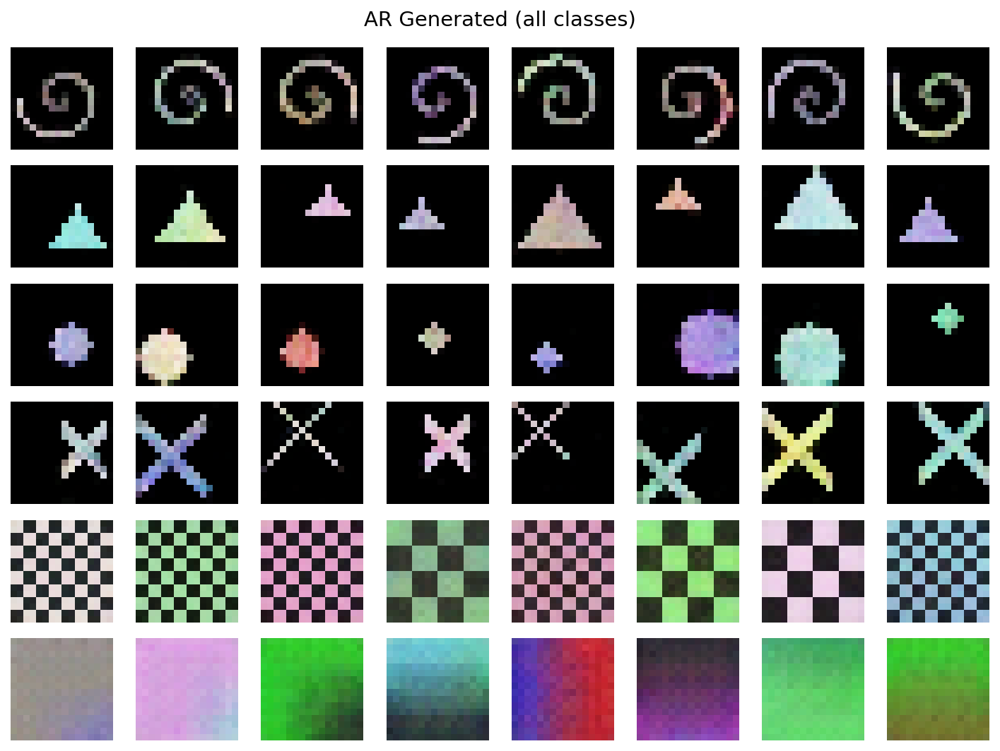

**Per-class observations:**
- Spirals, crosses, checkerboards: clearly recognizable
- Triangles, circles: correct shapes with some color/position variation
- Gradients: smooth transitions preserved

---

## 6. Phase B -- Flow Matching Transformer

### Architecture

- Input: 16x16x3 images patchified into 16 patches of 48-dim (4x4 patch size)
- Patch projection: Linear(48->128)
- Sinusoidal time embedding (128-dim) + class embedding (6 entries, 128-dim)
- 4 AdaLN transformer blocks:
  - Bidirectional self-attention (4 heads, 128 hidden)
  - AdaLN modulation: condition -> (shift, scale, gate) for each sub-layer
  - FFN: 128->512->128
- Output: Linear(128->48), unpatchified back to 16x16x3 velocity field
- **1.3M parameters**

### Training

- Epochs: 120, batch size: 64
- Optimizer: Adam, warmup 5 epochs (1e-6 -> 3e-4) + cosine decay to 0
- Flow matching: x_t = (1-t) * noise + t * x_0, target = x_0 - noise
- **Final velocity MSE: 0.084**

### Generation Results

Flow matching results are **mixed across classes**. Checkerboard and gradient classes produce reasonable outputs -- the model captures their repetitive/smooth structure. However, geometric shape classes (spirals, triangles, circles, crosses) are **largely unrecognizable** -- outputs appear as fragmented noise or scattered pixel clusters rather than coherent shapes.

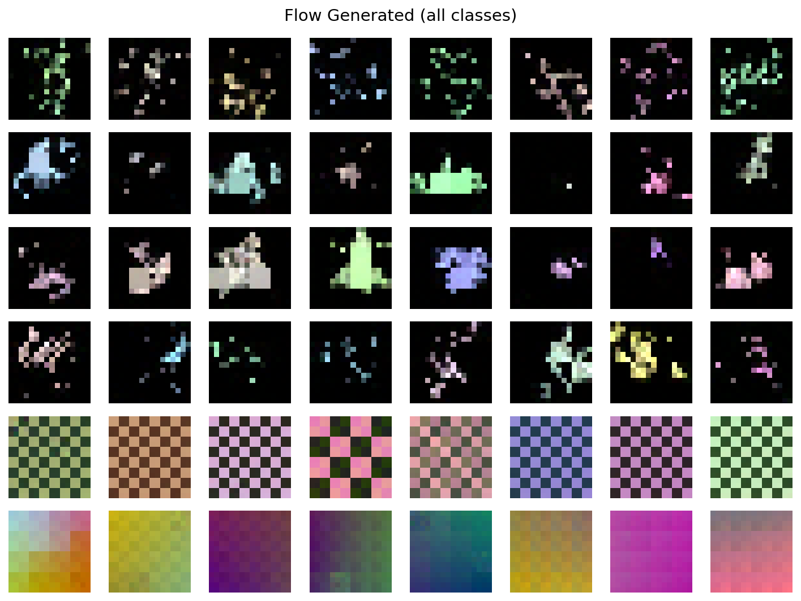

This suggests that at 16x16 resolution with only 16 patches, flow matching struggles to learn the precise spatial structure needed for geometric shapes. Repetitive patterns (checkerboard) and smooth fields (gradient) are easier targets for a continuous velocity field.

**ODE step comparison:**

| Steps | Quality |
|-------|---------|
| 10 | Noisy, no coherent structure for geometric classes |
| 20 | Marginally cleaner, geometric shapes still fragmented |
| 50 | Similar to 20 steps -- no meaningful improvement for structured classes |

| 10 steps | 20 steps | 50 steps |
|----------|----------|----------|
| 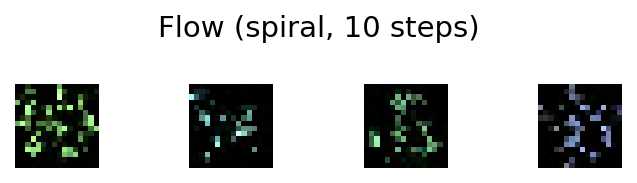 | 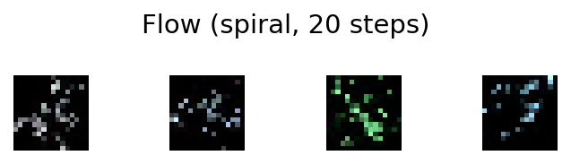 | 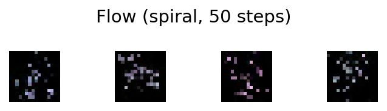 |

Increasing ODE steps does not rescue the geometric classes. The issue is the learned velocity field itself, not integration quality.

---

## 7. Phase C -- Neo-Unify (Baseline MoT)

### Architecture

The core innovation: a **Mixture-of-Transformers (MoT)** backbone where attention is shared between tasks but feed-forward networks are task-specific.

- Input: 16x16x3 -> patchify -> Linear(48->128) + positional embedding
- **6 MoT blocks**, each containing:
  - **Shared:** LayerNorm + bidirectional self-attention (4 heads, 128 hidden) + residual
  - **Understanding expert FFN:** LayerNorm + MLP(128->512->128) + residual
  - **Generation expert FFN:** LayerNorm (no affine) + AdaLN-modulated MLP + residual
- Understanding head: mean pool -> LayerNorm -> Linear(128->6) -> class logits
- Generation head: LayerNorm -> Linear(128->48) -> unpatchify -> velocity field
- **2.4M parameters**

### Training

- **18,000 images** (3,000 per class), 200 epochs, batch size 64
- **Alternating mini-batch updates:** each step performs 2 separate optimizer updates:
  1. Understanding update (cross-entropy loss on class logits)
  2. Generation update (flow matching MSE on velocity)
- Optimizer: Adam, warmup + cosine decay
- **Final metrics:** Understanding CE ~0.00, Generation MSE: **0.047**

### Results

**Classification accuracy: 6000/6000 = 100.0%**

| Class | Accuracy |
|-------|----------|
| spiral | 100.0% |
| triangle | 100.0% |
| circle | 100.0% |
| cross | 100.0% |
| checkerboard | 100.0% |
| gradient | 100.0% |

The shared backbone achieves **perfect classification** while simultaneously learning generation. Understanding does not degrade from sharing attention with the generation pathway.

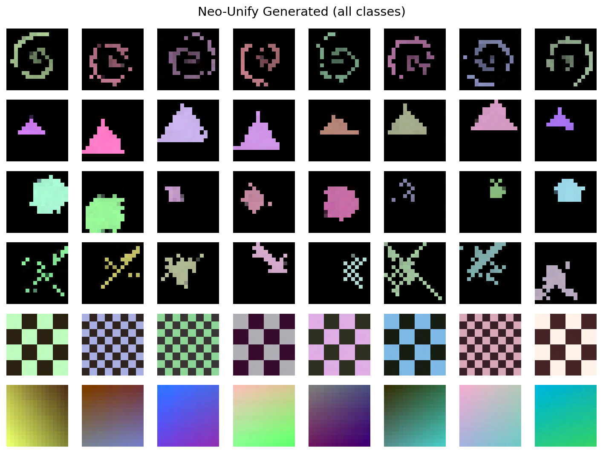

**Per-class observations:**
- Checkerboard, gradient: clearly recognizable, comparable to AR
- Spirals, crosses: structural form recovered (a clear improvement over standalone Flow), though softer than AR
- Triangles, circles: class-correct coloring and rough shape, but less crisp than AR outputs

Neo-Unify's generation is a clear step up from standalone Flow -- it recovers coherent structure for geometric classes that Flow fails on entirely -- but still produces softer outputs than AR across the board.

---

## 8. Exp CFG -- Neo-Unify + Classifier-Free Guidance + EMA + RK2

### What Changed

| Feature | Phase C | Exp CFG |
|---------|---------|---------|
| Epochs | 200 | **200** |
| Updates | Alternating | **Joint loss** |
| Loss | Separate CE / MSE | und + 3.0*gen + 1.0*recon |
| CFG | No | **Yes** (10% label dropout -> null class) |
| EMA | No | **Yes** (decay 0.999) |
| ODE solver | Euler | **RK2** (Heun's method) |
| Recon head | No | **Yes** (understand pathway reconstructs input) |

The null class is implemented as an extra embedding (index 6) in the class embedding table. During training, 10% of labels are randomly replaced with the null class to enable classifier-free guidance at inference.

### Training

- Joint loss: `total = CE + 3.0 * flow_MSE + 1.0 * recon_MSE`
- EMA tracks exponential moving average of all weights (decay 0.999)
- **18,000 images** (3,000 per class), 200 epochs
- **Final metrics:**
  - Understanding CE: ~0.00
  - Generation MSE: **0.055**
  - Reconstruction MSE: 0.000010

### Generation Results -- Guidance Scale Sweep

| gs=1.0 (no guidance) | gs=2.0 | gs=3.0 | gs=5.0 |
|----------------------|--------|--------|--------|
| 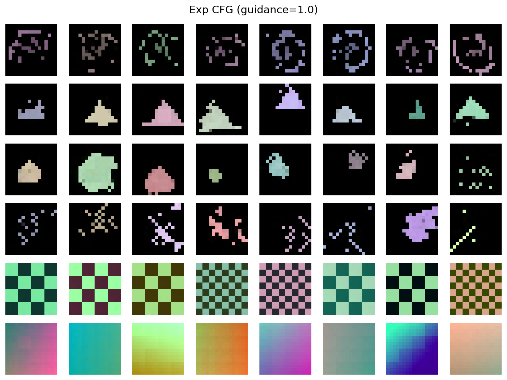 | 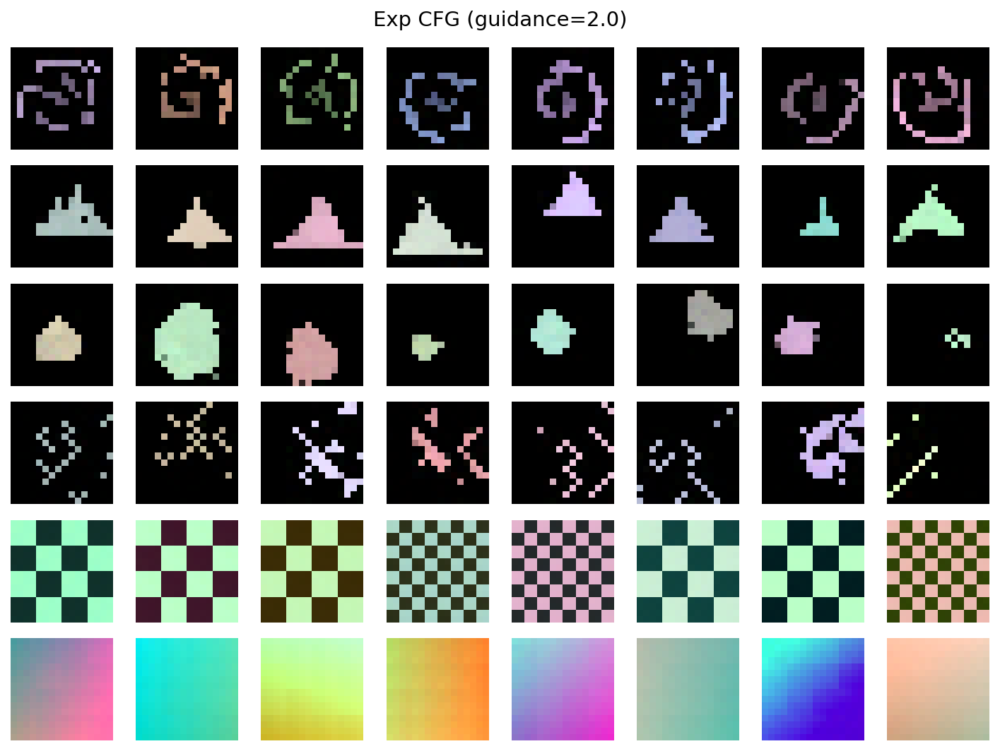 | 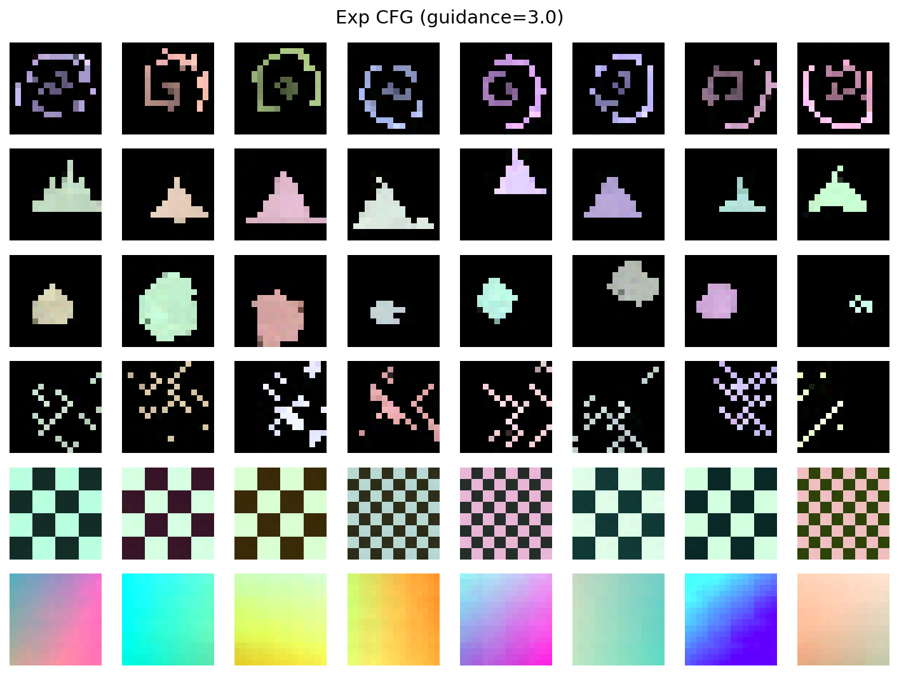 | 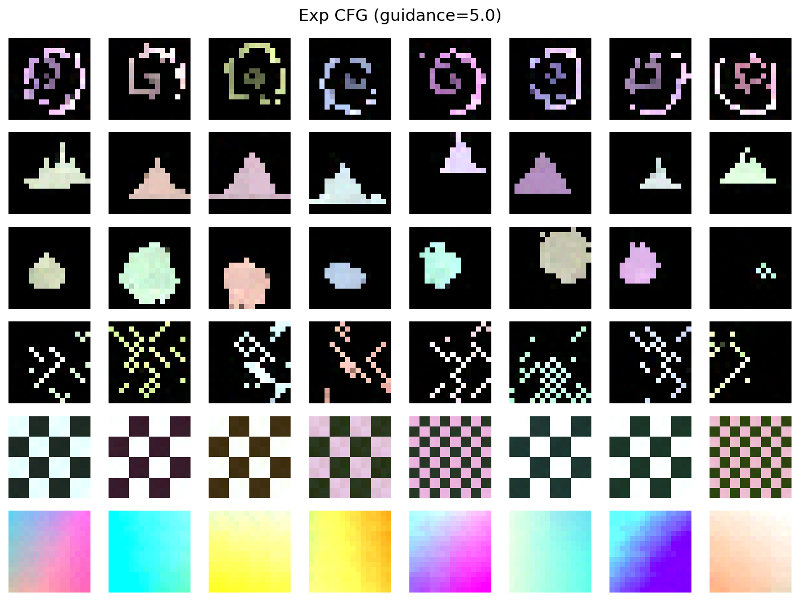 |

The effect of guidance scale is **subtle** at this scale. gs=1.0 to 2.0 shows virtually no visible change. gs=3.0-5.0 produces modest sharpening of class features, but the effect is far less dramatic than typically seen in larger diffusion models.

### Classification

**Accuracy: 6000/6000 = 100.0%** (all classes perfect)

### Reconstruction

The understand pathway's reconstruction head achieves near-perfect input reconstruction:

- **Reconstruction MSE: 0.000010** (vs VQ-VAE's 0.004 -- **400x better**)

This demonstrates that the MoT understand pathway retains far more spatial information than VQ-VAE's discrete bottleneck.

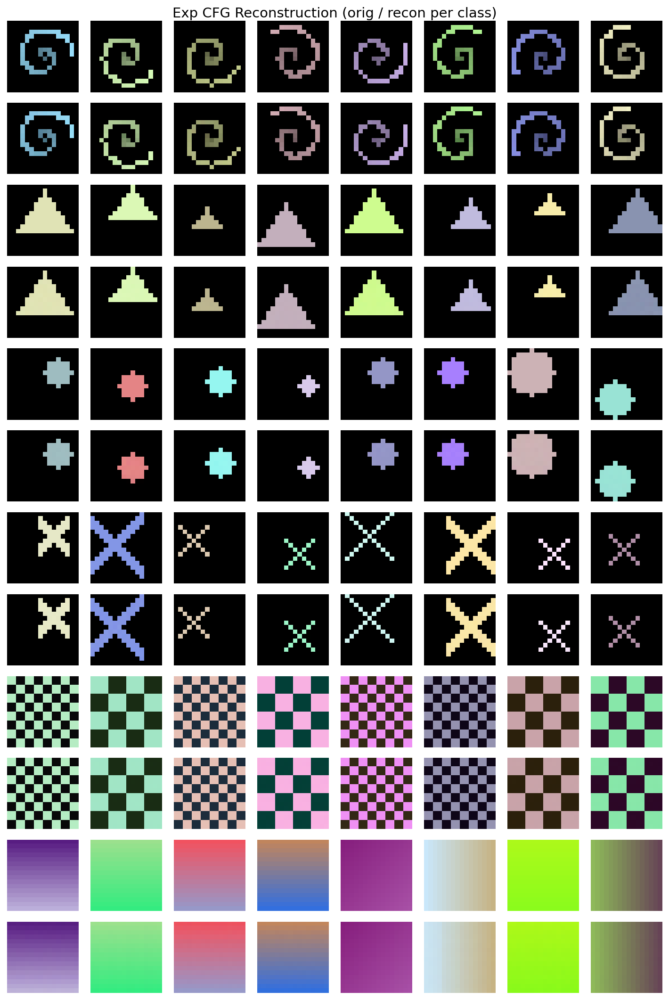

---

## 9. Exp Latent -- Neo-Unify in VQ-VAE Latent Space

### What Changed

Instead of generating in pixel space (16x16x3 = 768 dims), generation operates in the **VQ-VAE continuous latent space** (4x4x64 = 1024 dims).

| Feature | Exp CFG | Exp Latent |
|---------|---------|------------|
| Generation space | Pixel (16x16x3) | **Latent (4x4x64)** |
| Patch dim (gen) | 48 | **64** |
| VQ-VAE decoder | Not used | **Frozen, used at inference** |
| Dataset | Raw pixels | **Pre-encoded latents** |
| Patch projections | Shared | **Separate for understand/generate** |

The understanding pathway still operates on pixel-space images (for classification + reconstruction), while the generation pathway operates entirely in latent space.

### Training

- Pre-encode all 18,000 images to continuous latent representations via VQ-VAE encoder (before quantization)
- Same joint loss structure: `total = CE + 3.0 * latent_flow_MSE + 1.0 * pixel_recon_MSE`
- EMA decay 0.999, label dropout 10%, 200 epochs
- **Final metrics:**
  - Understanding CE: ~0.00
  - Generation MSE (latent): **0.114**
  - Reconstruction MSE: 0.000016

### Generation Results -- Guidance Scale Sweep

| gs=1.0 (no guidance) | gs=2.0 | gs=3.0 | gs=5.0 |
|----------------------|--------|--------|--------|
| 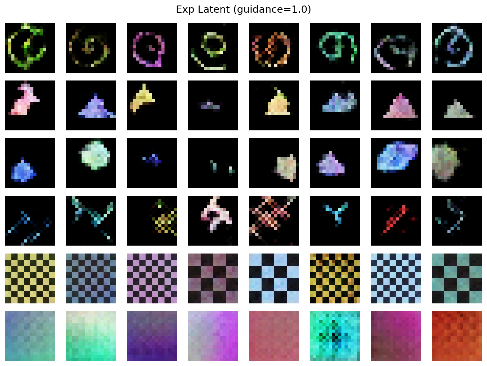 | 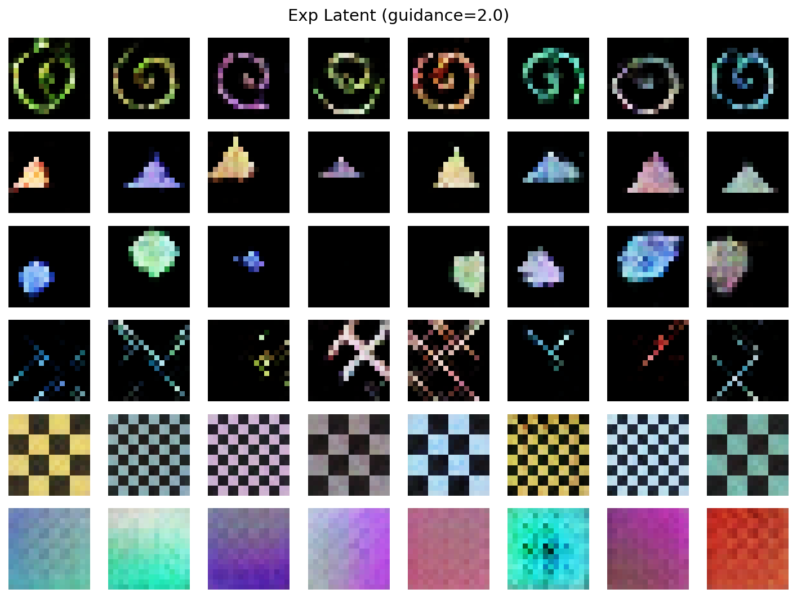 | 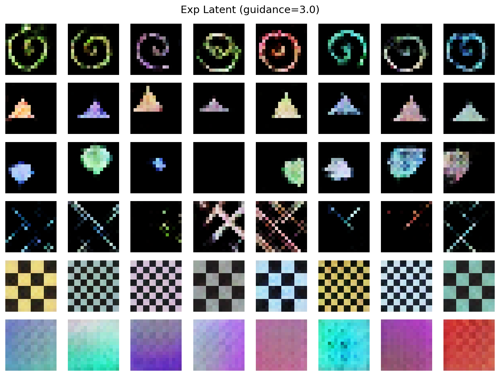 | 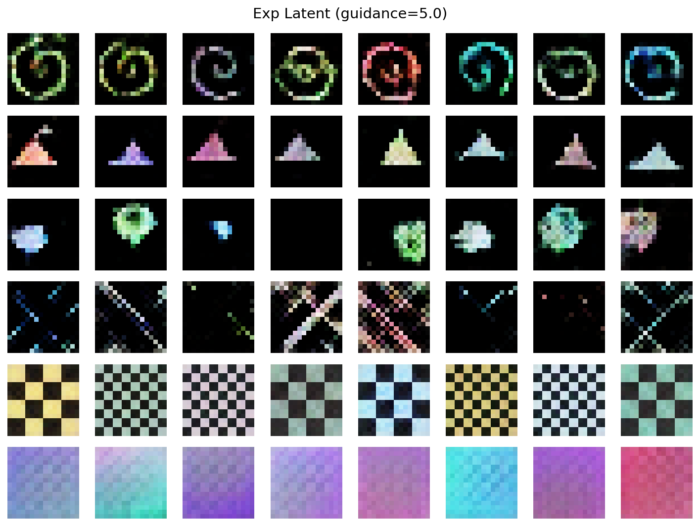 |

Latent-space generations are **noticeably grainier** than pixel-space CFG outputs at equivalent guidance scales. The frozen VQ-VAE decoder introduces quantization artifacts, and the higher-dimensional latent space (1024 vs 768 dims) makes the flow matching target harder to learn precisely.

### Classification

**Accuracy: 6000/6000 = 100.0%** (all classes perfect)

### Reconstruction

- **Reconstruction MSE: 0.000016** (understand pathway, slightly worse than Exp CFG's 0.000010 but still excellent)

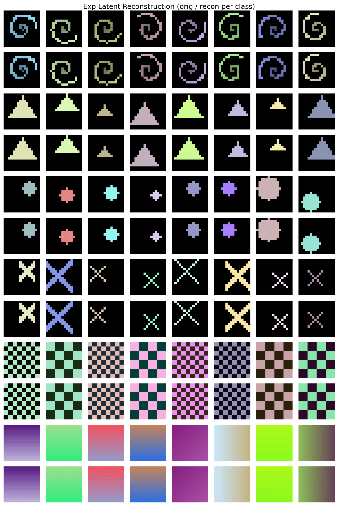

---

## 10. Cross-Model Comparison

### Visual Comparison

The comparison grid shows Real images alongside generations from AR, Flow, and Neo-Unify (Phase C):

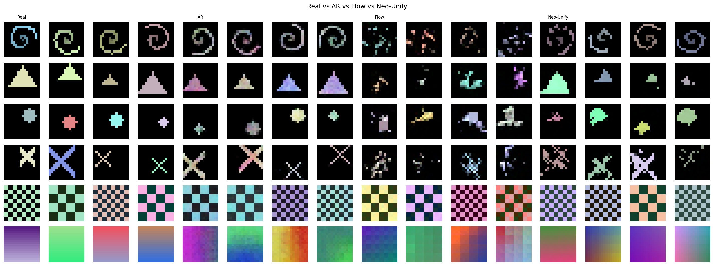

**Qualitative ranking:** AR clearly produces the sharpest, most class-correct outputs. Neo-Unify (MoT) is intermediate -- it recovers coherent structure that standalone Flow misses, but outputs are softer than AR. Standalone Flow struggles significantly with geometric shapes (spirals, triangles, circles, crosses), producing only recognizable checkerboard and gradient outputs.

### Per-Class Mean Pixel Intensity

| Class | Real | AR | Flow | Neo-Unify |
|-------|------|-----|------|-----------|
| spiral | 0.094 | 0.095 | 0.059 | 0.075 |
| triangle | 0.143 | 0.123 | 0.055 | 0.090 |
| circle | 0.073 | 0.058 | 0.100 | 0.084 |
| cross | 0.095 | 0.101 | 0.071 | 0.129 |
| checkerboard | 0.462 | 0.450 | 0.468 | 0.482 |
| gradient | 0.572 | 0.478 | 0.459 | 0.484 |

### All Models Side-by-Side

| Metric | VQ-VAE | ImageGPT | Flow | Neo-Unify | +CFG | +Latent |
|--------|--------|----------|------|-----------|------|---------|
| Parameters | 187K | 862K | 1.3M | 2.4M | 2.4M | 2.4M |
| Epochs | 80 | 150 | 120 | 200 | 200 | 200 |
| Training data | 6K | 6K | 6K | 18K | 18K | 18K |
| Classification | -- | -- | -- | 100% | 100% | 100% |
| Gen loss | Recon 0.004 | CE 0.43 | MSE 0.084 | MSE 0.047 | MSE 0.055 | MSE 0.114 |
| Recon MSE | 0.004 | -- | -- | -- | 0.000010 | 0.000016 |
| CFG support | -- | -- | -- | No | Yes | Yes |
| EMA | -- | -- | -- | No | Yes | Yes |
| ODE solver | -- | -- | Euler | Euler | RK2 | RK2 |

### Reconstruction Comparison

| Model | Recon MSE | Notes |
|-------|-----------|-------|
| VQ-VAE | 0.004 | Discrete bottleneck loses fine detail |
| Exp CFG (MoT understand) | 0.000010 | 400x better -- continuous pathway |
| Exp Latent (MoT understand) | 0.000016 | Still excellent, ~250x better than VQ-VAE |

---

## 11. Key Findings

### AR dominates at small scale
The discrete VQ-VAE bottleneck forces sharp, committed decisions at each spatial position. At 16x16 resolution with only 16 tokens, autoregressive generation produces the crispest outputs. The codebook acts as a strong inductive bias that is particularly effective at this resolution.

### Flow matching struggles with geometric shapes at 16x16
Standalone flow matching fails to produce recognizable geometric shapes (spirals, triangles, circles, crosses), though it handles repetitive patterns (checkerboard) and smooth fields (gradient) adequately. Learning a continuous velocity field over the full image is a harder optimization target than AR's discrete per-token prediction, especially when the shapes require precise spatial coordination across patches.

### MoT architecture preserves understanding
Across all three Neo-Unify variants (Phase C, Exp CFG, Exp Latent), classification accuracy remains **perfect at 100%**. The shared attention backbone learns representations useful for both tasks, and the expert FFNs prevent task interference. Understanding does not degrade from sharing a backbone with generation.

### More data + longer training helps significantly
With 3x more data (18K vs 6K images) and 200 epochs, Phase C's generation MSE dropped from 0.083 to **0.047** -- a 43% improvement. The model benefits from seeing more variation in each class.

### CFG + EMA + RK2 add controllability, not necessarily lower MSE
Phase C (MSE 0.047) actually achieves *lower* generation MSE than Exp CFG (MSE 0.055). The joint loss formulation and CFG label dropout introduce competing training objectives that raise the raw MSE. However, CFG provides **guidance controllability** -- the ability to trade diversity for fidelity at inference time -- which is a qualitative capability Phase C lacks. EMA smooths training dynamics, and RK2 (Heun's method) gives better ODE integration than Euler. At this small scale, the guidance effect is subtle (visible mainly at gs=3.0+).

### Latent-space generation: higher MSE and grainier outputs
Exp Latent operates in a higher-dimensional space (4x4x64 = 1024 vs 16x16x3 = 768). The generation MSE is higher (0.114 vs 0.055) and the decoded images are **noticeably grainier** than pixel-space CFG equivalents. The frozen VQ-VAE decoder introduces quantization artifacts, and the more complex latent target makes flow matching harder. At this small scale, pixel-space generation appears to be the better choice.

### MoT understand pathway retains more information than VQ-VAE
The continuous MoT understand pathway achieves reconstruction MSE of 0.000010 -- **400x better** than VQ-VAE's 0.004. This confirms that VQ-VAE's discrete quantization is a significant information bottleneck, while the MoT's continuous representations preserve nearly all spatial detail.

### AR's discrete bottleneck is a strong inductive bias at this scale
Flow-based generation (both standalone and within MoT) produces softer images than AR at 16x16. With only 16 tokens, AR can make sharp per-token decisions, while flow matching must learn a continuous velocity field over the full image. Whether this gap would close at higher resolutions remains an open question for future work.

---

## 12. Analysis: Why AR Wins at Small Scale

The AR approach outperforms continuous flow-based generation at this scale for four reinforcing reasons:

### 12.1 The Discrete Bottleneck Is Free Regularization

AR doesn't generate pixels directly. The VQ-VAE compresses each 16x16x3 image (768 floats) into just **16 tokens** from a 256-entry codebook. This is a massive dimensionality reduction:

- **AR generates in**: 16-dimensional categorical space (each token picks 1 of 256 entries)
- **Flow/Neo-Unify generate in**: 768-dimensional continuous space (raw pixel values)

The codebook forces the model to learn a clean, structured representation. Each codebook entry encodes a meaningful 4x4x3 patch prototype. Generation becomes a combinatorial puzzle over 16 clean building blocks rather than a regression over 768 noisy continuous values.

### 12.2 MSE Loss Doesn't Encourage Sharpness

Flow matching minimizes mean squared error between predicted and target velocity fields. MSE has a well-known failure mode: when a pixel could plausibly be 0.0 or 1.0, the MSE-optimal prediction is 0.5 (the mean), producing blur.

This is especially damaging for:
- **Thin structures** (spiral arms, cross diagonals): a 1-pixel line at slightly varying positions averages to a faint smear
- **Sharp edges** (triangle boundaries, circle perimeters): the model hedges between "inside" and "outside"

AR's cross-entropy over discrete tokens doesn't have this problem. It learns to *commit* to specific codebook entries, producing crisp outputs even at ambiguous positions.

### 12.3 Euler ODE Integration Accumulates Error

Flow generation uses 50-step Euler integration: `x_{i+1} = x_i + v(x_i, t_i) * dt`. Each step's small velocity prediction error compounds into the next step. After 50 steps, accumulated drift can push the trajectory away from the data manifold.

AR generation has no error accumulation between tokens. Each token is sampled independently conditioned on the sequence so far -- there's no ODE trajectory to drift off.

### 12.4 Scale Mismatch: Discrete Advantage at Tiny Scale

At 16x16 with ~1M parameters, the VQ-VAE compresses the problem so aggressively that the GPT's job is almost trivially easy: predict 16 categorical values with a 4-layer transformer. The flow model, by contrast, must learn a smooth continuous velocity field over 768 dimensions with similar capacity.

This advantage **shrinks at real scale**. At 256x256+ with billions of parameters:
- Continuous models have enough capacity to learn the velocity field well
- VQ-VAE reconstruction quality becomes the bottleneck (discrete tokens lose fine detail)
- Flow matching's continuous nature allows arbitrarily fine generation detail

This is a key reason why larger-scale systems tend toward continuous diffusion/flow approaches rather than discrete AR for image generation.

---

## 13. Improvement Roadmap

Five incremental directions to improve Neo-Unify's generation quality, ordered by effort-to-impact ratio. Three have been implemented as experiments.

### D1: Better ODE Sampling + Classifier-Free Guidance -- DONE (Exp CFG)

**Goal**: Improve generation quality without (or with minimal) retraining.
**Effort**: Small | **Expected Impact**: Medium

- **RK2 solver**: Replace Euler integration with Heun's method. O(dt^3) local error vs Euler's O(dt^2). Doubles compute per step but significantly better trajectory quality.
- **CFG**: Train with 10% label dropout to a null class. At inference, interpolate conditioned and unconditioned velocity predictions: `v = v_uncond + gs * (v_cond - v_uncond)`. Pushes samples toward high-likelihood regions of the class-conditional distribution.

**Result**: Implemented in Exp CFG. CFG effect is subtle at this scale (visible at gs=3.0+). RK2 provides cleaner ODE integration. See [Section 8](#8-exp-cfg----neo-unify--classifier-free-guidance--ema--rk2).

---

### D2: Training Improvements -- DONE (Exp CFG)

**Goal**: Better optimization for multi-task learning.
**Effort**: Small | **Expected Impact**: Medium

- **Joint gradient**: Compute both losses in a single forward pass and sum their gradients for one combined optimizer step. Eliminates the tug-of-war from alternating updates.
- **Adaptive loss weighting**: Weight generation higher (`total = und + 3.0 * gen + 1.0 * recon`) since generation is the harder task.
- **EMA**: Exponential moving average of model weights (decay 0.999). Smooths out noisy multi-task training updates.

**Result**: Implemented in Exp CFG. Joint loss + EMA provide stable training. See [Section 8](#8-exp-cfg----neo-unify--classifier-free-guidance--ema--rk2).

---

### D3: Representation Alignment (REPA) -- FUTURE

**Goal**: Make shared attention representations better for generation by regularizing them to be semantically meaningful.
**Effort**: Medium | **Expected Impact**: Medium

During generation training, take hidden states from a middle MoT block, mean-pool them, and add an auxiliary classification loss. This forces the generation pathway's attention representations to maintain semantic structure rather than degenerating into low-level pattern matching.

Implementation:
1. Add a small auxiliary classification head (`nn.Linear(hidden_dim, num_classes)`) to the model
2. During `forward_generate`, capture features from the middle (3rd) MoT block
3. Mean-pool those features and pass through the auxiliary head
4. Add `0.1 * cross_entropy(repa_logits, class_labels)` to the generation loss

This is lightweight (one extra linear layer) but encourages the shared attention to encode class-relevant features even during generation, preventing semantic drift that produces scattered noise instead of structured shapes.

---

### D4: Latent-Space Flow Matching -- DONE (Exp Latent)

**Goal**: Address the fundamental problem -- MSE regression in pixel space.
**Effort**: Medium | **Expected Impact**: High

Instead of flow matching in pixel space (16x16x3 = 768 dims), operate in the VQ-VAE's continuous latent space (4x4x64 = 1024 dims). The encoder has already learned to extract meaningful patch-level features, making the velocity field smoother and easier to predict.

Implementation:
1. Freeze the VQ-VAE encoder and decoder
2. Pre-encode the entire training set into latent space
3. Flow matching operates on (B, 4, 4, 64) instead of (B, 16, 16, 3)
4. At inference: generate latents via ODE integration, then decode through frozen VQ-VAE decoder

**Result**: Implemented in Exp Latent. At this small scale, latent-space generation actually produced grainier outputs (MSE 0.114) due to the higher-dimensional target and VQ-VAE decoder artifacts. The technique is expected to shine at larger scales. See [Section 9](#9-exp-latent----neo-unify-in-vq-vae-latent-space).

---

### D5: Perceptual and Adversarial Losses -- FUTURE

**Goal**: Replace pure MSE with losses that explicitly encourage sharpness.
**Effort**: Large | **Expected Impact**: High

- **Perceptual loss**: Use the trained VQ-VAE encoder as a perceptual distance metric -- compare generated and target images in feature space rather than pixel space. Encourages structural correctness over pixel-level matching.
- **Patch discriminator**: A tiny PatchGAN discriminator (~50K params) that judges whether 4x4 patches look real or fake. Pushes generated images away from the blurry MSE optimum.
- **Combined**: `total_gen = mse + 0.1 * perceptual + 0.01 * adversarial`

---

## 14. How to Run

```bash
# Phase A: VQ-VAE + Autoregressive
python3 -m phase_a.train_vqvae        # Train VQ-VAE tokenizer (~30s)
python3 -m phase_a.train_transformer   # Train AR transformer (~90s)
python3 -m phase_a.generate            # Generate images

# Phase B: Flow Matching
python3 -m phase_b.train              # Train flow model (~90s)
python3 -m phase_b.generate           # Generate images

# Phase C: Mini Neo-Unify
python3 -m phase_c.train              # Train unified model (~3 min)
python3 -m phase_c.generate           # Generate images + classify

# Exp CFG: Neo-Unify + CFG/EMA/RK2
python3 -m exp_cfg.train              # Train with CFG + EMA (~8 min)
python3 -m exp_cfg.generate           # Guidance scale sweep + classify + reconstruct

# Exp Latent: Neo-Unify in Latent Space
python3 -m exp_latent.train           # Train in VQ-VAE latent space (~8 min)
python3 -m exp_latent.generate        # Guidance scale sweep + classify + reconstruct

# Compare all models
python3 compare.py                     # 4-column comparison grid
```

## 15. File Structure

```
neo-unify/
+-- README.md                 # This file (project docs + full report)
+-- shared/
|   +-- data.py               # Synthetic dataset generator (6 classes)
|   +-- utils.py              # Visualization, comparison grids, loss plots
+-- phase_a/                  # VQ-VAE + AR (Chameleon-style)
|   +-- vqvae.py              # VQ-VAE encoder-quantizer-decoder
|   +-- transformer.py        # Class-conditional GPT
|   +-- train_vqvae.py
|   +-- train_transformer.py
|   +-- generate.py
+-- phase_b/                  # Flow Matching (Transfusion-style)
|   +-- model.py              # Patch-based flow matching transformer
|   +-- train.py
|   +-- generate.py
+-- phase_c/                  # Mini Neo-Unify (MoT)
|   +-- model.py              # NeoUnifyModel with MoTBlock
|   +-- train.py              # Alternating multi-task training
|   +-- generate.py           # Euler ODE generation + classification
+-- exp_cfg/                  # Neo-Unify + CFG/EMA/RK2
|   +-- model.py              # + null class embedding, recon head
|   +-- train.py              # Joint loss, label dropout, EMA
|   +-- generate.py           # RK2 sampling, guidance scale sweep
+-- exp_latent/               # Neo-Unify in VQ-VAE latent space
|   +-- model.py              # Separate understand/generate patch projections
|   +-- train.py              # Pre-encoded latent dataset, frozen VQ-VAE
|   +-- generate.py           # Latent-space RK2 sampling + VQ-VAE decode
+-- compare.py                # 4-column comparison (Real | AR | Flow | Neo-Unify)
+-- weights/                  # Saved .npz weight files
+-- outputs/                  # Generated images and plots
```

## 16. Requirements

- Python 3.9+
- MLX (`pip install mlx`)
- NumPy, Matplotlib

---

*All experiments run on Apple Silicon with MLX framework.*
